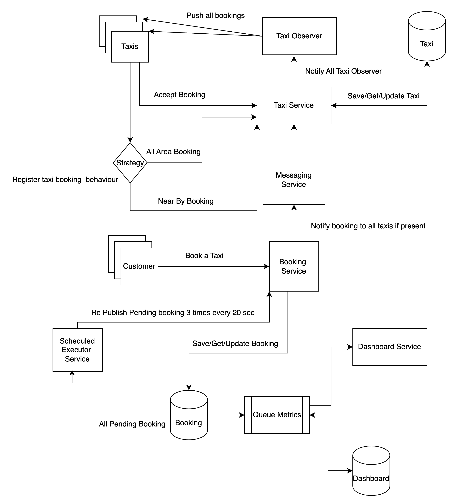
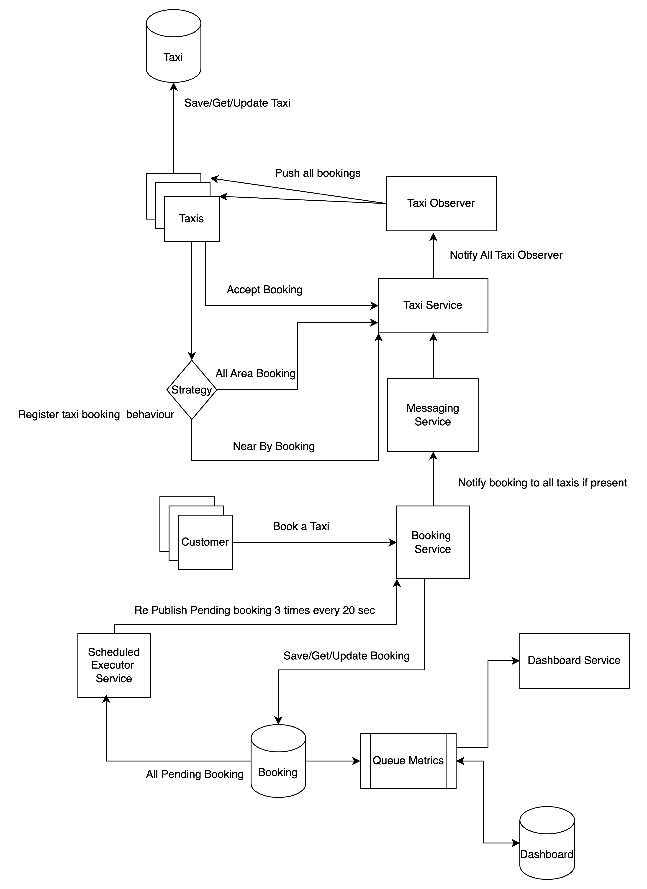

# Taxi Fleet Management System

## Overview

This project implements a simple communication system for a taxi fleet company. The application manages taxis, bookings, and provides a dashboard for statistics.

## Prerequisites

- Java 17 or higher
- Maven 3.8.5 or higher
- Docker containerized deployment

## Running the Application

### Using Maven

1. Clone the repository:
```sh
git clone https://github.com/<yourusername>/taxi-fleet.git
cd taxi-fleet
```   
Build the Docker image:
```sh
docker build -t taxifleet-app .
````
Run the Docker container:
   ```sh
docker run -p 8080:8080 taxifleet-app
 ```

### Using podman instead of Docker image:
```sh
podman build -t taxifleet-app .
````
Run the Docker container:
   ```sh
podman run -p 8080:8080 taxifleet-app
 ```

API Endpoints
   ```sh
GET /taxis: List all taxis with their status and location.
POST /bookings: Create a new booking and publish it to available taxis.
GET /dashboard/stats: Get booking statistics.
```
Testing:

To run tests use:
   ```sh
 mvn test
  ```

Notes:

This implementation uses an in-memory queue (BlockingQueue) for Main Service and Dashboard Service. Aiming to highly available and metrics load to be seperated

For a production-ready system, consider using external message brokers like RabbitMQ for better scalability and reliability.

This project focus more on Object Oriented Programming and Design patterns.

Contributions are welcome! Please fork the repository and submit a pull request.

### How to Download and Run

You can clone the repository, follow the instructions in the `README.md`, and the application should be up and running in no time.


### Architecture Overview

The system follows a service-oriented architecture with a focus on scalability and maintainability. Below is the UML class diagram representing the core components:


UML Diagrams
Interface:


Class:


Flow Diagram




Sample Logic 


