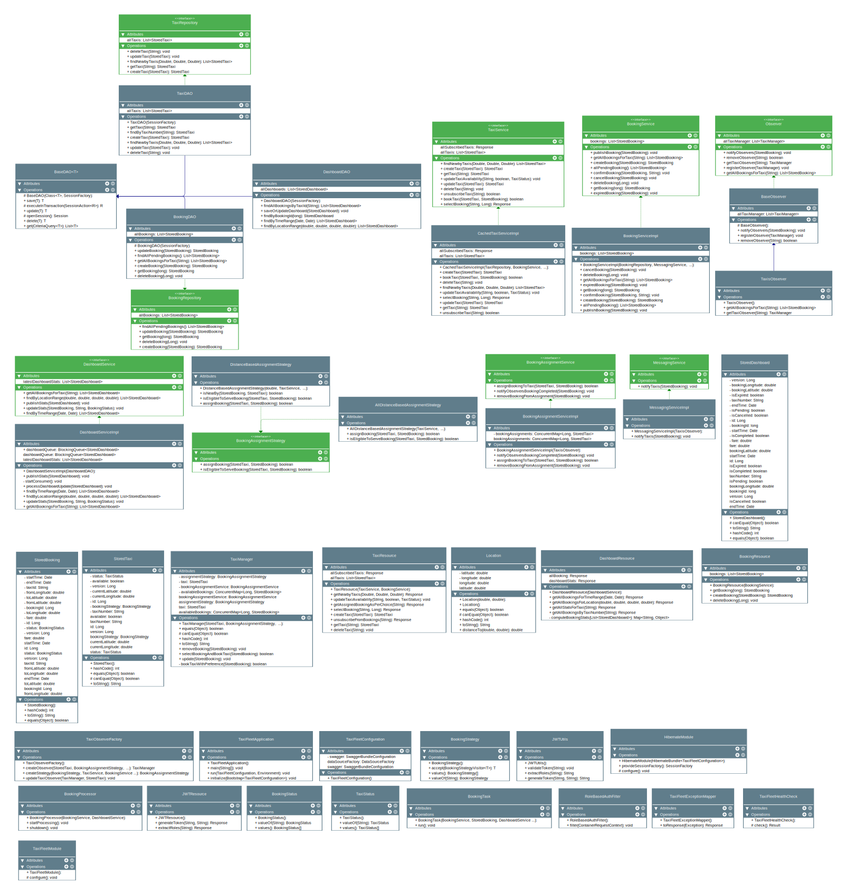

# Taxi Fleet Management System

## Overview

This project implements a simple communication system for a taxi fleet company. The application manages taxis, bookings,
and provides a dashboard for statistics.

## Prerequisites

- Java 17 or higher
- Maven 3.8.5 or higher
- Docker containerized deployment

## Running the Application

### Using Maven

1. Clone the repository:

```sh
git clone https://github.com/<yourusername>/taxi-fleet.git
cd taxi-fleet
```   

Build the Docker image:

```sh
docker build -t taxifleet-app .
````

Run the Docker container:

   ```sh
docker run -p 8080:8080 taxifleet-app
 ```

### Using podman instead of Docker image:

```sh
podman build -t taxifleet-app .
````

Run the Docker container:

   ```sh
podman run -p 8080:8080 taxifleet-app
 ```

API Endpoints

   ```sh
Taxi APIs
    GET /taxis: Returns a list of all taxis.
    GET /taxis/{taxiNumber}: Returns a taxi by its ID.
    POST /taxis: Creates a new taxi and returns the created taxi.
    PUT /taxis/{taxiNumber}/{availabilityStatus}: Sets the availability of a taxi by its ID.
    DELETE /taxis/{taxiNumber}: Deletes a taxi by its ID.
    GET /taxis/nearby: Returns a list of nearby taxis based on latitude, longitude, and radius.
    GET /taxis/all/booking/assigned: Returns all bookings assigned to a specific taxi.
    POST /taxis/{taxiNumber}/unsubscribe: Unsubscribes a taxi from receiving bookings.
    POST /taxis/{taxiNumber}/{bookingId}/select-booking: Selects a booking for the taxi.
    GET /taxis/all/subscribed/taxis: Returns all subscribed taxis (admin only).

Booking APIs
    GET /bookings: List all bookings.
    POST /bookings: Create a new booking.
    GET /bookings/{bookingId}: Get details of a specific booking.
    PUT /bookings/{bookingId}: Update a booking.
    DELETE /bookings/{bookingId}: Delete a booking.
    
Dashboard APIs
    GET /dashboard/booking/stats: Get all stats for Booking.
    GET /dashboard/all/bookings: Get all stats.
    GET /dashboard/stats/{taxiNumber}: Get all stats of Booking for taxis.
    GET /dashboard/stats/{taxiNumber}/bookings: Get all stats of Booking for taxis.
    GET /dashboard/stats/time/bookings: Get all stats of Booking for taxis according to time.
    GET /dashboard/stats/location/bookings/{minLatitude}/{maxLatitude}/{minLongitude}/{maxLongitude}: Get all stats of Booking done for taxis according to location.
    
JWT APIs
    GET /jwt/generate/{subject}/{role}: Generates a JWT token for a given subject and role.
    GET /jwt/roles/{token}: Extracts roles from a given JWT token.
```

Testing:

To run tests use:

   ```sh
 mvn test
  ```

### How to Download and Run

You can clone the repository, follow the instructions in the `README.md`, and the application should be up and running
in no time.

### Features Taxi Management:

Register and update the status of taxis (e.g., available, booked).
Track the current location and status of each taxi in the fleet.

### Booking Management:

Publish new bookings to all available taxis.
Ensured only one taxi accepts a booking, with the option to re-publish a rejected booking.
Implemented logic for nearby taxis to handle bookings based on proximity.

### Messaging Service:

Ensuring reliable and timely communication between taxis and the booking system.

### Dashboard:

Real-time display of key statistics, including the number of available taxis, bookings made, and completed trips.
Use Queue to separate out the load from actual service and metrics service

### Authentication and Security:

(Security Feature)

Implemented JSON Web Token (JWT) for secure authentication and authorization.
Ensure that only authorized users can access the system’s functionalities.

### Design Patterns

    Factory Pattern: Used to create instances of different types of messages and services.
    Strategy Pattern: Applied in the booking service to handle different strategies for assigning taxis to bookings.
    Observer Pattern: Implemented to notify the dashboard and other components of updates in taxi status or bookings.
    Singleton Pattern: Ensures that certain services have a single instance throughout the application.

### Architecture

The system is built using a modular architecture, where each component is responsible for a specific aspect of the
system’s functionality. The main modules include:

    Taxi Service: Manages the registration, status, and location of taxis.
    Booking Service: Handles the creation and management of bookings, including communication with taxis.
    Messaging Service: Manages communication for handling status updates and notifications.
    Dashboard Service: Aggregates and displays real-time statistics about the fleet.

UML Diagrams

Class:


Flow Diagram - LLD


Sample API Demo

[Watch The Demo](https://youtu.be/4Lu-KPF7LdU)

Contributions are welcome! Please fork the repository and submit a pull request.